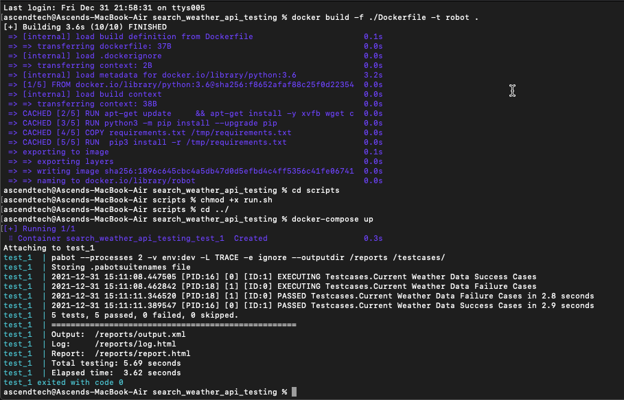

# README #

This README would normally document whatever steps are necessary to get the application up and running.

### What is this repository for? ###

* This repository for run API automated tests for the feature"search weather in your city" API.
  For this repository, I want to build a test Framework base on Python 3 and Robot Framework and run on a Docker image.
* API: api.openweathermap.org/data/2.5/weather?q={city name},{state code}&appid={API
key}

### How do I get set up and execute test scripts? ###

* Install Docker Desktop on Mac follow this link "https://docs.docker.com/desktop/mac/install/"
* Open command line and cd to root repository folder.
* Build the image with this command : "docker build -f ./Dockerfile -t robot ."
  Do not forget the dot at the end of the line! The dot means that Docker uses the Dockerfile in the local (current) folder.
* cd to folder 'scripts' and run command "chmod +x run.sh"
* cd back to root folder and run "docker-compose up" , the test should just run. Open the reports/report.html using your browser to dive into your test results.

Note: The test framework will run with all configures in /resources/config_dev.yaml file by default.
  If you want to run with configures in another configure file , let update ENV variable in /scripts/run.sh file
  with suffix name corresponding (ex: ENV=qa to run with config in config_qa.yaml)

